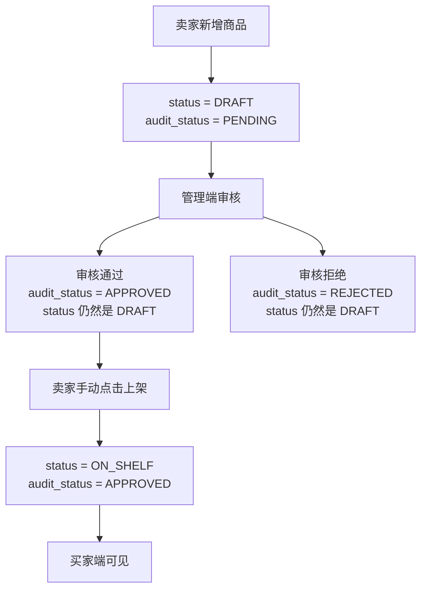

# Product_Status_Flow

## 文档定位

本文件用于梳理当前商品从新增、审核、上架到买家可见的状态流转。

当前项目里商品状态分成两个字段：

| 字段 | 含义 | 主要控制方 |
| --- | --- | --- |
| `status` | 商品上下架状态 | 卖家端 |
| `audit_status` | 商品审核状态 | 管理端 |

这两个字段不是同一个概念。

```text
status 解决：这个商品是否被卖家放到货架上。
audit_status 解决：这个商品是否被平台允许展示。
```

## 当前状态值

### status 商品上下架状态

| 值 | 说明 |
| --- | --- |
| `DRAFT` | 草稿或未上架状态，商品还不会进入买家可见列表 |
| `ON_SHELF` | 已上架，满足审核和库存条件后可以被买家看到 |
| `OFF_SHELF` | 已下架，后续用于卖家主动下架商品 |

### audit_status 商品审核状态

| 值 | 说明 |
| --- | --- |
| `PENDING` | 待审核，管理端需要处理 |
| `APPROVED` | 审核通过，允许卖家上架 |
| `REJECTED` | 审核拒绝，当前阶段暂不支持编辑后重新提交 |

## 当前主流程



## 当前规则答案

| 问题                        | 当前规则                                                      |
| ------------------------- | --------------------------------------------------------- |
| 新增商品默认 `status` 是什么       | `DRAFT`                                                   |
| 新增商品默认 `audit_status` 是什么 | `PENDING`                                                 |
| 新增商品后是否直接进入买家端            | 不进入                                                       |
| 审核通过后是否自动上架               | 不自动上架                                                     |
| 上架是否必须由卖家手动触发             | 是                                                         |
| 商品审核未通过能否上架               | 不能                                                        |
| 买家端展示哪些商品                 | `status = ON_SHELF`、`audit_status = APPROVED`、`stock > 0` |
| 拒绝后卖家如何编辑并重新提交            | 当前阶段暂未实现，后续需要补编辑和重新提交规则                                   |

## 当前代码对应关系

| 规则 | 代码位置 |
| --- | --- |
| 新增商品默认 `DRAFT` / `PENDING` | `ProductService.createProduct()` |
| 查询待审核商品 | `AdminHome.vue` 调用 `getAdminProductList({ auditStatus: 'PENDING' })` |
| 管理端审核通过或拒绝 | `ProductService.auditProduct()` |
| 审核通过后才能上架 | `ProductService.updateProductStatus()` |
| 买家端只看可见商品 | `ProductService.getBuyerVisibleProductList()` 和 `ProductMapper.findBuyerVisibleProducts()` |

## 为什么审核通过后不自动上架

当前选择：

```text
审核通过后，商品仍然保持 DRAFT，由卖家手动点击上架。
```

这样做的好处：

- 平台审核只代表“允许展示”，不代表卖家已经准备好销售。
- 卖家可以在审核通过后再确认库存、价格、图片等信息。
- 后续更容易支持“定时上架”“主动下架”“编辑后重新审核”等规则。

## 后续需要补的状态规则

### 1. 审核拒绝后重新提交

后续可以增加：

```text
REJECTED -> 卖家编辑商品 -> PENDING -> 管理端重新审核
```

可能需要新增接口：

| 接口 | 作用 |
| --- | --- |
| `PUT /api/seller/products/{productId}` | 卖家编辑商品 |
| `PATCH /api/seller/products/{productId}/submit-audit` | 卖家重新提交审核 |

### 2. 已上架商品编辑

后续需要明确：

```text
已上架商品修改图片、名称、价格后，是否需要重新审核？
```

服装批发场景里，商品图片和商品名称对买家决策影响很大，后续更建议：

| 编辑内容 | 是否重新审核 |
| --- | --- |
| 修改名称 | 需要 |
| 修改主图 | 需要 |
| 修改详情图 | 需要 |
| 修改价格 | 可先不需要 |
| 修改库存 | 可先不需要 |
| 修改起批量 | 可先不需要 |

### 3. 下架能力

后续可以补：

```text
ON_SHELF -> OFF_SHELF
OFF_SHELF -> ON_SHELF
```

重新上架时是否需要审核，取决于商品内容有没有变化。

## 下一阶段和图片能力的关系

商品主图加入后，当前状态规则暂时不变：

```text
卖家新增商品时填写 main_image_url
  -> 商品仍然默认 DRAFT / PENDING
  -> 管理端审核时能看到主图
  -> 审核通过后卖家手动上架
  -> 买家端看到商品主图
```

后续如果做“图片审核”，可以继续沿用 `audit_status`，也可以拆出更细的图片审核记录。
