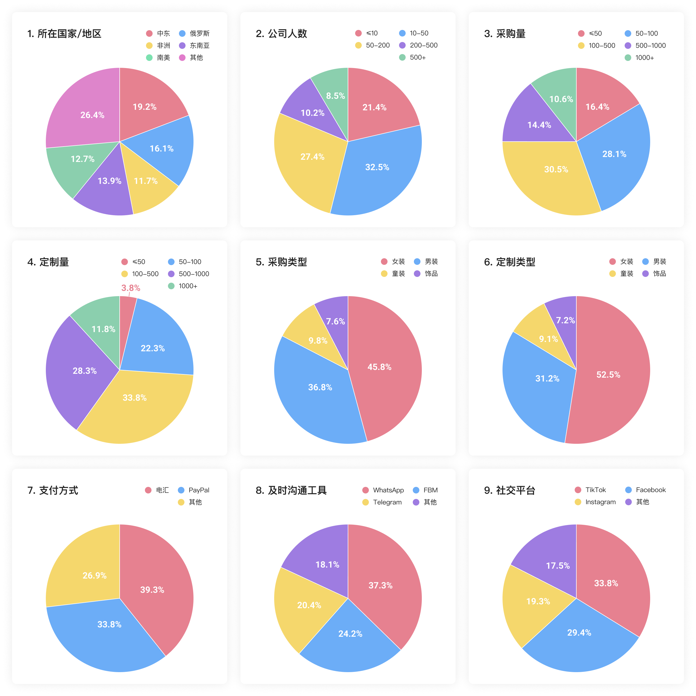
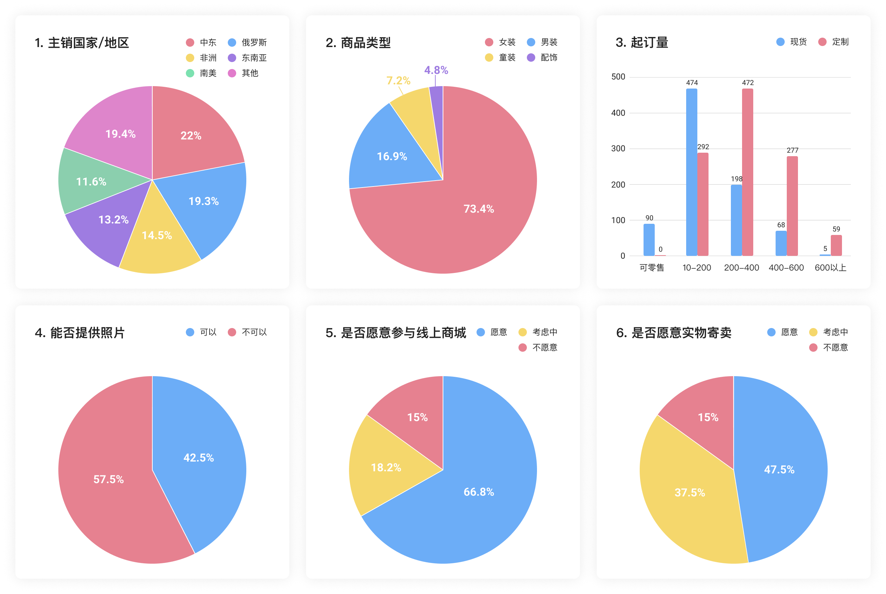
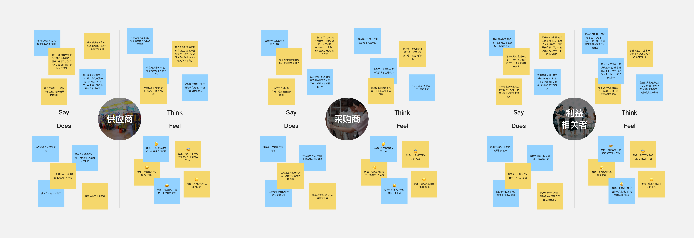
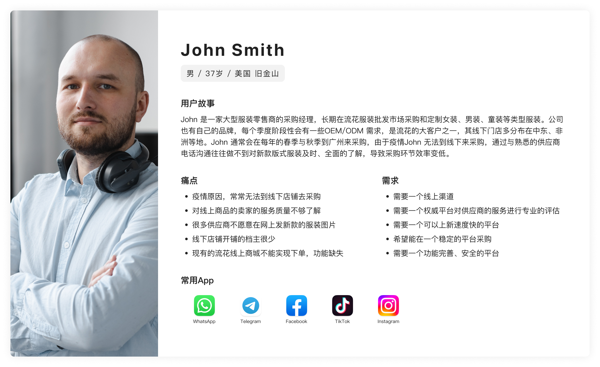
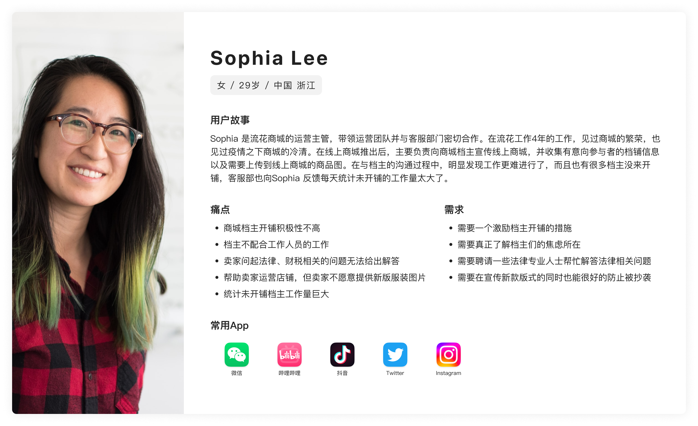

# Research1_初次卖家侧调研&分析

## S1. 文档定位

本文件用于收纳产品早期调研材料与分析过程，为 `PRD0_Product_Strategy.md` 的战略层和范围层结论提供依据。

这里保留调研数据、访谈问题、用户画像资料和卖家群体分层过程；问题定义作为战略层结论沉淀到 `PRD0`。

## 1. 现状调研补充

### 1.1 市场与供给背景

- 流花服装批发市场本身具备较大的服饰供给基础，调研资料中提到已有 `600万+` 款服饰沉淀。
- 市场内同时存在现货与定制两类供货场景，卖家的经营方式并不单一。
- 面向海外采购商的业务具备一定流量基础，调研资料中提到已有 `100万+` 采购商流量、`1000万+` 平台流量、`2亿+` 触达人次。
- 海外买家触达方式以 Facebook、TikTok、Instagram 等社媒渠道为主，说明买家获取更偏线上跨境触达。
- 从现状来看，平台需要面对的不只是交易撮合问题，还包括供给组织、买家触达和跨境场景适配问题。

### 1.2 资料来源

## 2. 定量调研

### 2.1 买家端调研数据

通过线上问卷的形式，800 余个采购商返回的数据如下：

### 2.2 卖家端调研数据

经过一个月的实地走访，1200 余个供应商返回的数据如下：

## 3. 定性研究

本次定性研究围绕供应商、采购商和利益相关者展开，通过访谈问题收集一线反馈，并使用 Empathy Map 形式整理用户表达、认知、行为与情绪。

### 3.1 主要询问项

**供应商询问项**

- 目前遇到最大的困难是什么？
- 需要市场怎样的支持与服务？

**采购商询问项**

- 在采购或定制的过程中你常常会遇到哪些问题？
- 分别谈谈对线上采购和线下采购的看法，看好哪种？优势在哪？

**利益相关者询问项**

- 在平时工作中接触到的用户是否有与你反馈一些问题？
- 哪个是你认为当前急需解决的问题？
- 在解决问题上我们存在哪些阻力？阻力产生的原因是什么？该如何解决？

### 3.2 Empathy Map 问题反馈

## 4. 用户分析资料w

早期调研重点集中在卖家群体，是因为团队入驻在商城内，距离卖家最近，调研成本最低，也能更快获得高密度的一线反馈。项目初期优先服务好卖家后，卖家有机会把既有线下客户、老客户复购和日常采购沟通逐步带到线上，因此卖家是早期供给组织和流量迁移的关键节点。买家和利益相关者画像先保留为基础参考，后续上线后再结合真实使用数据继续细化。

### 4.1 买家与利益相关者画像资料

### 4.2 卖家标签维度分析

主动性分析：
客户较少 + 能力不具备 + 信任 = 积极
客户稳定 + 能力具备 + 观望 = 中性
客户较少 + 能力不具备 + 不信任 = 消极
客户稳定 + 能力具备 + 不信任 = 拒绝或低配合

<table>
  <thead>
    <tr>
      <th>标签维度</th>
      <th>特征标签</th>
      <th>分析</th>
      <th>痛点</th>
      <th>解决方案</th>
    </tr>
  </thead>
  <tbody>
    <tr>
      <td rowspan="2">客户现状</td>
      <td>客户稳定</td>
      <td>客户虽然有所减少，但仍具备出货能力，已经积累了一些客户，可以通过电话、即时通讯工具联系客户，有自己出货渠道。</td>
      <td>1. 客户较少； 2. 效率变低：只能通过及时通讯工具发照片给买家的方式来交易。</td>
      <td></td>
    </tr>
    <tr>
      <td>客户较少</td>
      <td>过往积累的回头客较少，缺少了线下交易的渠道后，就几乎没有客户了。</td>
      <td>缺少客户。</td>
      <td></td>
    </tr>
    <tr>
      <td rowspan="2">线上跨境经营能力</td>
      <td>具备</td>
      <td>很少有成熟数字化能力的商户，可能部分已经具备数字化能力的商户属于拒绝沟通那一类，所以选择不配合商城的调研。</td>
      <td>--</td>
      <td></td>
    </tr>
    <tr>
      <td>不具备</td>
      <td>1. 跨境收款银行卡被冻结； 2. 不懂一些跨境相关的法律问题； 3. 入驻其他平台后操作困难，费力完成商品上架后商品缺少曝光，很少人下单。</td>
      <td>1. 有跨境交易的问题； 2. 有些跨境的法律政策问题无人了解； 3. 缺乏运营知识。</td>
      <td></td>
    </tr>
    <tr>
      <td rowspan="3">对平台信任程度</td>
      <td>信任</td>
      <td>认为自己也没有好的出路，很多跨境相关的政策了解不足，自己付了商城租金，商城应该帮忙想办法。</td>
      <td>1. 生意变差导致无法承担当前的租金。</td>
      <td></td>
    </tr>
    <tr>
      <td>观望</td>
      <td>看看身边的租户（卖家）是否入驻线上商城，入驻的人多，自己也入驻。</td>
      <td>不确定平台是否有效，缺少可参考的成功案例。</td>
      <td></td>
    </tr>
    <tr>
      <td>不信任</td>
      <td>1.认为商城只是在做样子，想稳住大家继续开张以维持表面上的繁荣而已。 2.服装板式上传到线上展示后很容易被同行模仿抄版</td>
      <td>1. 对商城方了解不足、失去希望，觉得其他平台有更好的发展； 2.怕被同行抄袭</td>
      <td></td>
    </tr>
  </tbody>
</table>

## 5. 问题定义

问题定义已作为战略层结论沉淀到 `PRD0_Product_Strategy.md` 的 `1.4 问题定义` 中。本文档保留调研材料和用户分析过程，用于支撑问题定义的来源。
