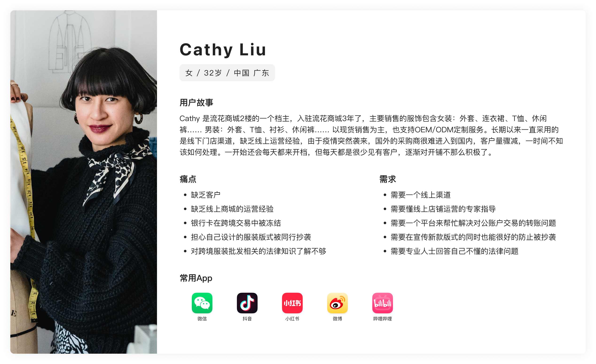

# Research1_初次卖家侧调研

## S1. 文档定位

本文件用于收纳产品早期调研材料与分析过程，为 `PRD0_Product_Strategy.md` 的战略层和范围层结论提供依据。

这里保留调研数据、访谈问题、用户画像资料、问题定义和卖家群体分层；`PRD0` 只保留由这些材料收敛出的产品结论。

## 1. 现状调研补充

### 1.1 市场与供给背景

- 流花服装批发市场本身具备较大的服饰供给基础，调研资料中提到已有 `600万+` 款服饰沉淀。
- 市场内同时存在现货与定制两类供货场景，卖家的经营方式并不单一。
- 面向海外采购商的业务具备一定流量基础，调研资料中提到已有 `100万+` 采购商流量、`1000万+` 平台流量、`2亿+` 触达人次。
- 海外买家触达方式以 Facebook、TikTok、Instagram 等社媒渠道为主，说明买家获取更偏线上跨境触达。
- 从现状来看，平台需要面对的不只是交易撮合问题，还包括供给组织、买家触达和跨境场景适配问题。

### 1.2 资料来源

## 2. 定量调研

### 2.1 买家端调研数据

通过线上问卷的形式，800 余个采购商返回的数据如下：

### 2.2 卖家端调研数据

经过一个月的实地走访，1200 余个供应商返回的数据如下：

## 3. 定性研究

本次定性研究围绕供应商、采购商和利益相关者展开，通过访谈问题收集一线反馈，并使用 Empathy Map 形式整理用户表达、认知、行为与情绪。

### 3.1 主要询问项

**供应商询问项**

- 目前遇到最大的困难是什么？
- 需要市场怎样的支持与服务？

**采购商询问项**

- 在采购或定制的过程中你常常会遇到哪些问题？
- 分别谈谈对线上采购和线下采购的看法，看好哪种？优势在哪？

**利益相关者询问项**

- 在平时工作中接触到的用户是否有与你反馈一些问题？
- 哪个是你认为当前急需解决的问题？
- 在解决问题上我们存在哪些阻力？阻力产生的原因是什么？该如何解决？

### 3.2 Empathy Map 问题反馈

## 4. 用户画像资料

## 5. 问题定义

| 问题定义 | 主要用户画像 | 任务划分 |
| --- | --- | --- |
| 1. 商城客户骤减，供应商们的订单也少了很多。因为疫情国外采购商无法到线下来采购。采购商希望能更方便高效地采购，不受空间距离所影响。 | 采购商 | 服务设计、交互设计 |
| 2. 线上商城对供应商没有足够的吸引力，参与人数不多。因为供应商们没有充分了解到线上商城的政策，担心仅凭自己无法运营好线上商城。供应商希望能有专业运营团队帮忙指导或代运营。 | 供应商 | 服务设计 |
| 3. 商城客服人员收到大量银行卡被冻结的反馈需要处理，影响到了商城的跨境交易。因为公安部为了防止洗钱活动，经由公账户汇款至个人卡这类交易就会被冻结账户。供应商希望能更方便地进行跨境交易。 | 供应商 | 服务设计 |
| 4. 供应商不愿意提供新款服装的照片，这将影响商城服装的上新速度。因为供应商们担心自己新设计的版式会被同行抄袭。供应商希望自己的服装版式独一无二，版权受到保护。 | 供应商 | 交互设计 |
| 5. 商城客服人员经常会被供应商问到一些法律、财税相关的问题，触及到知识盲区，使得商城无法很好地给供应商提供服务。因为供应商们在做跨境业务时常常会有不了解的地方，转移到线上商城这一新领域后更是如此。供应商们希望有专业的法律人士来解答自己的困惑。 | 供应商 | 服务设计 |
| 6. 在宣传初版线上商城后，吸引到的采购商并不多。因为采购商对供应商的服务与服装质量没有一个清晰的认知，不敢轻易下单。采购商希望在采购的过程中安全可靠，没有风险。 | 采购商 | 服务设计、交互设计、视觉设计 |
| 7. 商城工作推进变得困难，很多供应商对商城的信任度降低。因为疫情使商城客户减少，供应商生意变差，没有赚到钱还要交租金，心理不平衡。档主希望商城对这种局面做出及时有效的对策，减少自己的损失。 | 供应商 | 服务设计 |

## 6. 卖家标签维度与主动性分层

### 6.1 标签维度

- 主动性
- 客户现状
- 当前出路
- 核心诉求
- 数字化能力
- 对平台的信任程度

### 6.2 按主动性划分的卖家群体

| 主动性类型 | 典型状态        | 形成原因                    | 核心痛点            | 对商城期待             | 可能解决方式                            |
| ----- | ----------- | ----------------------- | --------------- | ----------------- | --------------------------------- |
| 积极    | 愿意配合、愿意尝试   | 客户紧缺，没有更好出路，希望找到增量      | 缺客户、缺方法、缺线上经验   | 商城给出有效方案并带来结果     | 产品：低门槛入驻、流量入口、询盘承接；服务：运营指导、代上传、培训 |
| 中性    | 配合度一般，无明显态度 | 手里有稳定客户，不依赖线下客流         | 没有明显经营压力        | 有帮助最好，没有也无所谓      | 产品：轻量触达、低打扰工具；服务：案例展示、效果证明        |
| 消极    | 抱怨、抵触、不信任   | 疫情影响生意，但商城仍按原价收租，情绪迁怒平台 | 生意变差、成本压力大、信任下降 | 商城先解决现实压力或给出补偿性方案 | 服务：政策沟通、减压方案、信任修复；产品不是第一优先        |
| 拒绝沟通  | 不愿参与，不愿表达   | 已有其他出路，或准备撤场，不想再投入      | 对当前平台失去兴趣       | 基本无期待，更多是退出       | 运营判断是否继续投入；产品侧优先级最低               |
